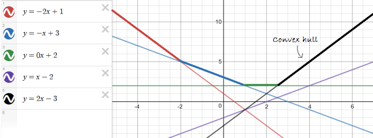
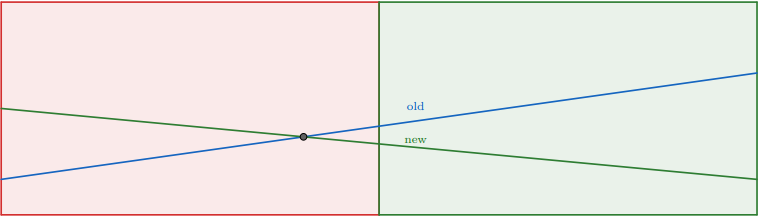

# Các thuật toán nâng cao

## Mục lục:
- [I. Convex hull trick + Lichao Tree: Tối ưu hóa các bài toán động với hàm tuyến tính.](#i-convex-hull-trick-và-lichao-tree)

- [II. Alien Trick: Kỹ thuật tối ưu hóa các bài toán động với các hàm không tuyến tính.](#ii-alien-trick)

- [III. Slope Trick: Tối ưu hóa các bài toán động với các hàm chi phí có dạng hàm bậc nhất.](#iii-slope-trick)

- [IV. Heavy-Light Decomposition: Phân tích cây để xử lý các truy vấn nhanh chóng.](#iv-heavy-light-decomposition)

- [V. Persistent Data Structures: Cấu trúc dữ liệu có thể lưu trữ các phiên bản trước đó.](#v-persistent-data-structures)


- [VI. Mo's Algorithm: Tối ưu hóa các truy vấn trên mảng.](#vi-mos-algorithm)

- [VII. Link/Cut Trees: Cấu trúc dữ liệu để xử lý các truy vấn động trên cây.](#vii-linkcut-trees)

- [VIII. Suffix Automaton: Cấu trúc dữ liệu để xử lý các bài toán chuỗi.](#viii-suffix-automaton)

- [IX. Suffix Array](#ix-suffix-array)

- [X. KMP và Aho-Corasick](#x-kmp-và-aho-corasick) 

- [XI. Luồng cực đại trên mạng](#xi-luồng-cực-đại-trên-mạng)

--- 

## I. Convex Hull Trick và Lichao Tree

### 1. Giới thiệu sơ bộ về Convex hull trick và Lichao tree.
**Convex Hull Trick** và **Lichao tree** là một kỹ thuật tối ưu hóa các bài toán động với hàm tuyến tính. Nó giúp tìm giá trị nhỏ nhất hoặc lớn nhất của một tập hợp các hàm tuyến tính tại một điểm cụ thể. Kỹ thuật này thường được sử dụng trong các bài toán liên quan đến tối ưu hóa chi phí hoặc lợi nhuận.

### 2. Nguyên lý hoạt động của Convex hull trick.
Convex Hull Trick hoạt động dựa trên việc duy trì một tập hợp các đoạn thẳng (hàm tuyến tính) và tìm giá trị nhỏ nhất hoặc lớn nhất của chúng tại một điểm cụ thể. Để làm điều này, chúng ta cần duy trì một tập hợp các đoạn thẳng sao cho không có đoạn thẳng nào bị che khuất bởi các đoạn thẳng khác.

- Ví dụ mô tả về convex hull trick khi tìm `answer = max(y = f(x) = ax + b)`


Thuật toán Convex Hull Trick được cung cấp dưới dây chỉ hoạt động hiệu quả khi các giá trị x được truy vấn theo thứ tự tăng dần. Để xử lý các giá trị x xuất hiện ngẫu nhiên, chúng ta cần sử dụng *Lichao tree*

### 3. Code mẫu của Convex hull trick
- Dưới đây là code mẫu của Convex Hull Trick khi tìm `answer = min(y = f(x) = ax + b)`
``` cpp
#include <iostream>
#include <deque>
using namespace std;

struct Line {
    long long a, b;
    Line(long long a = 0, long long b = 0) : a(a), b(b) {}
    long long value(long long x) {
        return a * x + b;
    }
};

bool isBad(Line l1, Line l2, Line l3) {
    return (l3.b - l1.b) * (l1.a - l2.a) < (l2.b - l1.b) * (l1.a - l3.a);
}

class ConvexHullTrick {
public:
    deque<Line> hull;

    void addLine(long long a, long long b) {
        Line newLine(a, b);
        while (hull.size() >= 2 && isBad(hull[hull.size() - 2], hull[hull.size() - 1], newLine)) {
            hull.pop_back();
        }
        hull.push_back(newLine);
    }

    long long getMinValue(long long x) {
        while (hull.size() >= 2 && hull[0].value(x) >= hull[1].value(x)) {
            hull.pop_front();
        }
        return hull[0].value(x);
    }
};

int main() {
    ConvexHullTrick cht;
    cht.addLine(2, 3); // y = 2x + 3
    cht.addLine(1, 5); // y = x + 5
    cout << "Minimum value at x = 1: " << cht.getMinValue(1) << endl; // Output: 4
    cout << "Minimum value at x = 2: " << cht.getMinValue(2) << endl; // Output: 5
    return 0;
}
```

### 4. Sơ lược về Lichao tree.


### 4. Code mẫu của Lichao tree.
``` c++
#include <iostream>
#include <vector>
#include <algorithm>
using namespace std;

struct Line {
    long long a, b;
    Line(long long a = 0, long long b = 0) : a(a), b(b) {}
    long long value(long long x) {
        return a * x + b;
    }
};

class LiChaoTree {
public:
    vector<Line> tree;
    int size;

    LiChaoTree(int n) : size(n) {
        tree.resize(4 * n, Line(0, LLONG_MAX));
    }

    void addLine(Line newLine, int node, int l, int r) {
        int m = (l + r) / 2;
        bool left = newLine.value(l) < tree[node].value(l);
        bool mid = newLine.value(m) < tree[node].value(m);

        if (mid) { // nếu newLine tốt hơn Line cũ tại m
            swap(tree[node], newLine);
        }

        if (l == r) {
            return;
        } else if (left != mid) {
            addLine(newLine, 2 * node, l, m);
        } else {
            addLine(newLine, 2 * node + 1, m + 1, r);
        }
    }

    long long getMinValue(int x, int node, int l, int r) {
        if (l == r) {
            return tree[node].value(x);
        }

        int m = (l + r) / 2;
        if (x <= m) {
            return min(tree[node].value(x), getMinValue(x, 2 * node, l, m));
        } else {
            return min(tree[node].value(x), getMinValue(x, 2 * node + 1, m + 1, r));
        }
    }

    void addLine(Line newLine) {
        addLine(newLine, 1, 0, size - 1);
    }

    long long getMinValue(int x) {
        return getMinValue(x, 1, 0, size - 1);
    }
};

int main() {
    int n = 100000; // Kích thước của cây phân đoạn
    LiChaoTree lct(n);
    lct.addLine(Line(2, 3)); // y = 2x + 3
    lct.addLine(Line(1, 5)); // y = x + 5
    cout << "Minimum value at x = 1: " << lct.getMinValue(1) << endl; // Output: 4
    cout << "Minimum value at x = 2: " << lct.getMinValue(2) << endl; // Output: 5
    return 0;
}
```

## II. Alien Trick
### 1. Alien Trick là gì? 

Alien trick là một kỹ thuật tối ưu hóa động (Dynamic Programming) được sử dụng để giải quyết các bài toán có ràng buộc. Kỹ thuật này dựa trên một nguyên lý đơn giản nhưng mạnh mẽ, thường được gọi là "Lagrange sufficiency theorem". Nguyên lý này cho phép chúng ta tối ưu hóa một hàm giá trị với một hàm ràng buộc bằng cách sử dụng một tham số Lagrange.

### 2. Nguyên lý hoạt động
Giả sử chúng ta có một tập hợp X, một hàm giá trị f: X → R và một hàm ràng buộc h: X → R với một ràng buộc cụ thể b ∈ R. Nếu tồn tại một tham số λ ∈ R và một giá trị x ∈ X sao cho x tối ưu hóa hàm L(x, λ) = f(x) - λ(h(x) - b) và h(x) = b, thì x cũng tối ưu hóa hàm f(x) với ràng buộc h(x) = b.

### 3. Mã nguồn ví dụ
Dưới đây là một ví dụ mã nguồn bằng C++ để minh họa Alien Trick:

``` cpp
#include <iostream>
#include <vector>
#include <algorithm>
using namespace std;

const int INF = 1e9;

struct DP {
    int cost;
    int parts;
    DP(int cost = INF, int parts = 0) : cost(cost), parts(parts) {}
    bool operator<(const DP& other) const {
        return cost < other.cost;
    }
};

int main() {
    int n, k;
    cin >> n >> k;
    vector<int> a(n);
    for (int i = 0; i < n; ++i) {
        cin >> a[i];
    }

    vector<DP> dp(n + 1, DP());
    dp[0] = DP(0, 0);

    for (int i = 1; i <= n; ++i) {
        for (int j = 0; j < i; ++j) {
            int cost = dp[j].cost + (a[i - 1] - a[j]) * (a[i - 1] - a[j]);
            int parts = dp[j].parts + 1;
            if (parts <= k) {
                dp[i] = min(dp[i], DP(cost, parts));
            }
        }
    }

    int result = INF;
    for (int i = 1; i <= n; ++i) {
        if (dp[i].parts == k) {
            result = min(result, dp[i].cost);
        }
    }

    cout << "Minimum cost: " << result << endl;
    return 0;
}
```
Trong ví dụ này, chúng ta sử dụng Alien Trick để tối ưu hóa chi phí của việc chia một dãy số thành k phần sao cho tổng chi phí là nhỏ nhất. Hy vọng mã nguồn này sẽ giúp bạn hiểu rõ hơn về Alien Trick! 🚀

Nếu bạn muốn tìm hiểu thêm, bạn có thể tham khảo bài viết chi tiết tại https://mamnoonsiam.github.io/posts/attack-on-aliens.html.

## III. Slope Trick
### 1. Slope Trick là gì? 
Slope Trick là một kỹ thuật tối ưu hóa động (Dynamic Programming) được sử dụng để giải quyết các bài toán có hàm chi phí có dạng hàm bậc nhất. Kỹ thuật này giúp chuyển đổi bài toán thành một dạng dễ giải quyết hơn bằng cách sử dụng các đoạn thẳng.

### 2. Nguyên lý hoạt động
Slope Trick hoạt động dựa trên việc duy trì một tập hợp các đoạn thẳng và tìm giá trị nhỏ nhất hoặc lớn nhất của chúng tại một điểm cụ thể. Kỹ thuật này thường được sử dụng trong các bài toán liên quan đến tối ưu hóa chi phí hoặc lợi nhuận.

### 3. Mã nguồn ví dụ
Dưới đây là một ví dụ mã nguồn bằng C++ để minh họa Slope Trick:

``` cpp
#include <iostream>
#include <vector>
#include <algorithm>
#include <queue>
using namespace std;

const long long INF = 1e18;

class SlopeTrick {
public:
    long long min_f;
    priority_queue<long long> L;
    priority_queue<long long, vector<long long>, greater<long long>> R;
    long long add_l, add_r;

    SlopeTrick() : min_f(0), add_l(0), add_r(0) {}

    void add_line(long long a, long long b) {
        L.push(a - add_l);
        R.push(b - add_r);
        if (L.top() > R.top()) {
            long long l = L.top(), r = R.top();
            L.pop();
            R.pop();
            L.push(r);
            R.push(l);
            min_f += l - r;
        }
    }

    void add_constant(long long c) {
        min_f += c;
    }

    void add_abs(long long a) {
        add_line(a, a);
    }

    void add_x_minus_a(long long a) {
        add_line(-INF, a);
        add_line(a, INF);
    }

    void add_a_minus_x(long long a) {
        add_line(a, INF);
        add_line(-INF, a);
    }

    long long get_min() {
        return min_f;
    }
};

int main() {
    SlopeTrick st;
    st.add_abs(3);
    st.add_x_minus_a(5);
    st.add_a_minus_x(2);
    cout << "Minimum value: " << st.get_min() << endl; // Output: 0
    return 0;
}
```
Trong ví dụ này, chúng ta sử dụng Slope Trick để tối ưu hóa chi phí của một hàm bậc nhất. Hy vọng mã nguồn này sẽ giúp bạn hiểu rõ hơn về Slope Trick! 🚀

Các nguồn tham khảo: https://usaco.guide/adv/slope-trick?lang=cpp

## IV. Heavy-Light Decomposition
### 1. Heavy-Light Decomposition (HLD) là gì? 
Heavy-Light Decomposition (HLD) là một kỹ thuật mạnh mẽ để xử lý các truy vấn và cập nhật trên cây một cách hiệu quả. Kỹ thuật này chia cây thành các đoạn "nặng" và "nhẹ" để tối ưu hóa việc truy vấn và cập nhật.

### 2. Nguyên lý hoạt động
HLD chia cây thành các chuỗi (chains) sao cho mỗi chuỗi chứa các cạnh "nặng" (heavy) và các cạnh "nhẹ" (light). Một cạnh được coi là "nặng" nếu nó dẫn đến một cây con có kích thước lớn nhất trong số các cây con của nút hiện tại. Ngược lại, các cạnh còn lại được coi là "nhẹ".

Các bước thực hiện:
- Đánh dấu các cạnh nặng và nhẹ: Bắt đầu từ gốc cây, đánh dấu các cạnh nặng và nhẹ dựa trên kích thước của các cây con.

- Chia cây thành các chuỗi: Mỗi chuỗi bắt đầu từ một nút và tiếp tục theo các cạnh nặng cho đến khi gặp một cạnh nhẹ hoặc lá.

- Xử lý các truy vấn và cập nhật: Sử dụng các cấu trúc dữ liệu như Segment Tree hoặc Fenwick Tree để xử lý các truy vấn và cập nhật trên các chuỗi.

### 3. Mã nguồn ví dụ
Dưới đây là một ví dụ mã nguồn bằng C++ để minh họa Heavy-Light Decomposition:

``` cpp
#include <iostream>
#include <vector>
using namespace std;

const int MAXN = 100005;
vector<int> adj[MAXN];
int parent[MAXN], depth[MAXN], heavy[MAXN], head[MAXN], pos[MAXN];
int cur_pos;

int dfs(int v) {
    int size = 1;
    int max_c_size = 0;
    for (int c : adj[v]) {
        if (c == parent[v]) continue;
        parent[c] = v;
        depth[c] = depth[v] + 1;
        int c_size = dfs(c);
        size += c_size;
        if (c_size > max_c_size) {
            max_c_size = c_size;
            heavy[v] = c;
        }
    }
    return size;
}

void decompose(int v, int h) {
    head[v] = h;
    pos[v] = cur_pos++;
    if (heavy[v] != -1) {
        decompose(heavy[v], h);
    }
    for (int c : adj[v]) {
        if (c != parent[v] && c != heavy[v]) {
            decompose(c, c);
        }
    }
}

void init(int n) {
    for (int i = 0; i < n; i++) {
        heavy[i] = -1;
    }
    parent[0] = -1;
    depth[0] = 0;
    cur_pos = 0;
    dfs(0);
    decompose(0, 0);
}

int main() {
    int n;
    cin >> n;
    for (int i = 0; i < n - 1; i++) {
        int u, v;
        cin >> u >> v;
        adj[u].push_back(v);
        adj[v].push_back(u);
    }
    init(n);
    // Bây giờ bạn có thể sử dụng các cấu trúc dữ liệu như Segment Tree để xử lý các truy vấn và cập nhật.
    return 0;
}
```
- Trong ví dụ này, chúng ta sử dụng Heavy-Light Decomposition để chia cây thành các chuỗi và chuẩn bị cho việc xử lý các truy vấn và cập nhật. Hy vọng mã nguồn này sẽ giúp bạn hiểu rõ hơn về Heavy-Light Decomposition! 🚀

## V. Persistent Data Structure
### 1. Persistent Data Structures là gì?
Persistent Data Structures là các cấu trúc dữ liệu cho phép lưu trữ và truy cập các phiên bản trước đó của dữ liệu mà không làm mất đi các phiên bản cũ. Điều này rất hữu ích trong các bài toán yêu cầu truy xuất lịch sử hoặc các phiên bản khác nhau của dữ liệu.

### 2. Nguyên lý hoạt động
Persistent Data Structures hoạt động bằng cách lưu trữ các thay đổi thay vì sao chép toàn bộ cấu trúc dữ liệu mỗi khi có thay đổi. Có hai loại chính của Persistent Data Structures:

- Partial Persistence: Cho phép truy cập các phiên bản cũ nhưng chỉ cho phép cập nhật phiên bản mới nhất.

- Full Persistence: Cho phép truy cập và cập nhật tất cả các phiên bản.

### 3. Ví dụ mã nguồn
Dưới đây là một ví dụ mã nguồn bằng C++ để minh họa Persistent Segment Tree, một dạng của Persistent Data Structures:

``` cpp
#include <iostream>
#include <vector>
using namespace std;

struct Node {
    int value;
    Node* left;
    Node* right;
    Node(int value) : value(value), left(nullptr), right(nullptr) {}
};

class PersistentSegmentTree {
public:
    vector<Node*> roots;
    int size;

    PersistentSegmentTree(int size) : size(size) {
        roots.push_back(build(0, size - 1));
    }

    Node* build(int l, int r) {
        if (l == r) return new Node(0);
        int m = (l + r) / 2;
        Node* node = new Node(0);
        node->left = build(l, m);
        node->right = build(m + 1, r);
        return node;
    }

    Node* update(Node* node, int l, int r, int idx, int value) {
        if (l == r) return new Node(node->value + value);
        int m = (l + r) / 2;
        Node* newNode = new Node(0);
        if (idx <= m) {
            newNode->left = update(node->left, l, m, idx, value);
            newNode->right = node->right;
        } else {
            newNode->left = node->left;
            newNode->right = update(node->right, m + 1, r, idx, value);
        }
        newNode->value = newNode->left->value + newNode->right->value;
        return newNode;
    }

    void update(int idx, int value) {
        roots.push_back(update(roots.back(), 0, size - 1, idx, value));
    }

    int query(Node* node, int l, int r, int ql, int qr) {
        if (ql > r || qr < l) return 0;
        if (ql <= l && qr >= r) return node->value;
        int m = (l + r) / 2;
        return query(node->left, l, m, ql, qr) + query(node->right, m + 1, r, ql, qr);
    }

    int query(int version, int ql, int qr) {
        return query(roots[version], 0, size - 1, ql, qr);
    }
};

int main() {
    int n = 10; // Kích thước của mảng
    PersistentSegmentTree pst(n);
    pst.update(2, 5); // Cập nhật giá trị tại vị trí 2 lên 5
    pst.update(4, 3); // Cập nhật giá trị tại vị trí 4 lên 3
    cout << "Sum from 0 to 4 in version 0: " << pst.query(0, 0, 4) << endl; // Output: 0
    cout << "Sum from 0 to 4 in version 1: " << pst.query(1, 0, 4) << endl; // Output: 5
    cout << "Sum from 0 to 4 in version 2: " << pst.query(2, 0, 4) << endl; // Output: 8
    return 0;
}
```
- Trong ví dụ này, chúng ta sử dụng Persistent Segment Tree để lưu trữ và truy cập các phiên bản khác nhau của mảng. Mỗi lần cập nhật, chúng ta tạo ra một phiên bản mới của cây phân đoạn mà không làm mất đi các phiên bản cũ. Hy vọng mã nguồn này sẽ giúp bạn hiểu rõ hơn về Persistent Data Structures! 🚀

## VI. Mo's Algorithm
### 1. Mo's Algorithm là gì?
Mo's Algorithm là một kỹ thuật mạnh mẽ để xử lý các truy vấn trên mảng một cách hiệu quả. Kỹ thuật này đặc biệt hữu ích khi bạn có nhiều truy vấn và cần tối ưu hóa thời gian xử lý. Mo's Algorithm hoạt động dựa trên việc chia mảng thành các khối và xử lý các truy vấn theo từng khối để giảm độ phức tạp.

### 2. Nguyên lý hoạt động
Chia mảng thành các khối: Chia mảng thành các khối có kích thước √N, với N là số phần tử trong mảng.

Sắp xếp các truy vấn: Sắp xếp các truy vấn theo thứ tự của khối bắt đầu và khối kết thúc.

Xử lý các truy vấn: Duyệt qua các truy vấn và cập nhật kết quả bằng cách thêm hoặc loại bỏ các phần tử từ các khối.

### 3. Mã nguồn ví dụ
Dưới đây là một ví dụ mã nguồn bằng C++ để minh họa Mo's Algorithm:

``` cpp
#include <iostream>
#include <vector>
#include <algorithm>
#include <cmath>
using namespace std;

struct Query {
    int l, r, idx;
    bool operator<(const Query& other) const {
        int block_own = l / block_size;
        int block_other = other.l / block_size;
        if (block_own != block_other) return block_own < block_other;
        return r < other.r;
    }
};

const int MAXN = 100005;
int block_size;
int arr[MAXN], freq[MAXN], result[MAXN];
int current_answer = 0;

void add(int x) {
    freq[x]++;
    if (freq[x] == 1) current_answer++;
}

void remove(int x) {
    if (freq[x] == 1) current_answer--;
    freq[x]--;
}

int main() {
    int n, q;
    cin >> n >> q;
    block_size = sqrt(n);
    for (int i = 0; i < n; ++i) {
        cin >> arr[i];
    }
    vector<Query> queries(q);
    for (int i = 0; i < q; ++i) {
        cin >> queries[i].l >> queries[i].r;
        queries[i].l--;
        queries[i].r--;
        queries[i].idx = i;
    }
    sort(queries.begin(), queries.end());

    int current_l = 0, current_r = -1;
    for (const Query& query : queries) {
        while (current_r < query.r) add(arr[++current_r]);
        while (current_r > query.r) remove(arr[current_r--]);
        while (current_l < query.l) remove(arr[current_l++]);
        while (current_l > query.l) add(arr[--current_l]);
        result[query.idx] = current_answer;
    }

    for (int i = 0; i < q; ++i) {
        cout << result[i] << endl;
    }

    return 0;
}
```
Trong ví dụ này, chúng ta sử dụng Mo's Algorithm để xử lý các truy vấn trên mảng. Mỗi truy vấn yêu cầu đếm số lượng các phần tử khác nhau trong một đoạn của mảng. Hy vọng mã nguồn này sẽ giúp bạn hiểu rõ hơn về Mo's Algorithm! 🚀

## VII. Link/Cut Trees
### 1. Link/Cut Tree là gì?
Link/Cut Tree là một cấu trúc dữ liệu mạnh mẽ để xử lý các truy vấn động trên cây. Nó cho phép thêm, xóa và truy vấn các cạnh trong cây một cách hiệu quả. Link/Cut Tree được sử dụng rộng rãi trong các bài toán liên quan đến cây và đồ thị, đặc biệt là trong các bài toán yêu cầu cập nhật và truy vấn động.

### 2. Nguyên lý hoạt động
Link/Cut Tree hoạt động dựa trên việc duy trì một tập hợp các cây con và cho phép các thao tác như liên kết (link), cắt (cut), và truy vấn (query) trên các cây này. Các thao tác chính bao gồm:

Link(v, w): Liên kết đỉnh v với đỉnh w, tạo thành một cạnh mới.

Cut(v): Cắt cạnh nối đỉnh v với cha của nó.

FindRoot(v): Tìm gốc của cây chứa đỉnh v.

Path(v, w): Truy vấn đường đi từ đỉnh v đến đỉnh w.

### 3. Mã nguồn ví dụ
Dưới đây là một ví dụ mã nguồn bằng C++ để minh họa Link/Cut Tree:

``` cpp
#include <iostream>
#include <vector>
using namespace std;

struct Node {
    Node *left, *right, *parent;
    bool revert;
    Node() : left(nullptr), right(nullptr), parent(nullptr), revert(false) {}
};

class LinkCutTree {
public:
    vector<Node> nodes;

    LinkCutTree(int n) : nodes(n) {}

    void push(Node* x) {
        if (x && x->revert) {
            swap(x->left, x->right);
            if (x->left) x->left->revert ^= true;
            if (x->right) x->right->revert ^= true;
            x->revert = false;
        }
    }

    void rotate(Node* x) {
        Node* p = x->parent;
        Node* g = p->parent;
        if (p->left == x) {
            p->left = x->right;
            if (x->right) x->right->parent = p;
            x->right = p;
        } else {
            p->right = x->left;
            if (x->left) x->left->parent = p;
            x->left = p;
        }
        p->parent = x;
        x->parent = g;
        if (g) {
            if (g->left == p) g->left = x;
            else g->right = x;
        }
    }

    void splay(Node* x) {
        while (x->parent) {
            Node* p = x->parent;
            Node* g = p->parent;
            if (g) push(g);
            push(p);
            push(x);
            if (g) {
                if ((g->left == p) == (p->left == x)) rotate(p);
                else rotate(x);
            }
            rotate(x);
        }
        push(x);
    }

    Node* access(Node* x) {
        Node* last = nullptr;
        for (Node* y = x; y; y = y->parent) {
            splay(y);
            y->left = last;
            last = y;
        }
        splay(x);
        return last;
    }

    void makeRoot(Node* x) {
        access(x);
        x->revert ^= true;
    }

    void link(Node* x, Node* y) {
        makeRoot(x);
        x->parent = y;
    }

    void cut(Node* x) {
        access(x);
        if (x->right) {
            x->right->parent = nullptr;
            x->right = nullptr;
        }
    }

    Node* findRoot(Node* x) {
        access(x);
        while (x->left) x = x->left;
        splay(x);
        return x;
    }
};

int main() {
    int n = 5; // Số lượng đỉnh
    LinkCutTree lct(n);
    lct.link(&lct.nodes[0], &lct.nodes[1]);
    lct.link(&lct.nodes[1], &lct.nodes[2]);
    lct.link(&lct.nodes[2], &lct.nodes[3]);
    lct.link(&lct.nodes[3], &lct.nodes[4]);

    cout << "Root of node 4: " << (lct.findRoot(&lct.nodes[4]) - &lct.nodes[0]) << endl; // Output: 0

    lct.cut(&lct.nodes[3]);
    cout << "Root of node 4 after cut: " << (lct.findRoot(&lct.nodes[4]) - &lct.nodes[0]) << endl; // Output: 4

    return 0;
}
```
Trong ví dụ này, chúng ta sử dụng Link/Cut Tree để thực hiện các thao tác liên kết, cắt và tìm gốc của các đỉnh trong cây. Hy vọng mã nguồn này sẽ giúp bạn hiểu rõ hơn về Link/Cut Tree! 🚀

## VIII. Suffix Automaton
### 1. Suffix Automaton là gì?
Suffix Automaton là một cấu trúc dữ liệu mạnh mẽ để xử lý các bài toán liên quan đến chuỗi. Nó giúp tìm kiếm các mẫu con trong chuỗi một cách nhanh chóng và hiệu quả. Suffix Automaton có thể được sử dụng để giải quyết nhiều bài toán khác nhau như tìm kiếm mẫu, đếm số lượng mẫu con khác nhau, và nhiều bài toán khác liên quan đến chuỗi

### 2.Nguyên lý hoạt động
Suffix Automaton là một đồ thị có hướng, trong đó mỗi đỉnh đại diện cho một trạng thái của chuỗi và mỗi cạnh đại diện cho một ký tự chuyển tiếp. Đồ thị này được xây dựng sao cho nó chứa tất cả các mẫu con của chuỗi ban đầu. Mỗi trạng thái trong Suffix Automaton đại diện cho một tập hợp các vị trí kết thúc của các mẫu con trong chuỗi.

### 3.Mã nguồn ví dụ
Dưới đây là một ví dụ mã nguồn bằng C++ để minh họa Suffix Automaton:

``` cpp
#include <iostream>
#include <map>
#include <vector>
using namespace std;

struct State {
    int length, link;
    map<char, int> next;
};

class SuffixAutomaton {
public:
    vector<State> st;
    int last;

    SuffixAutomaton(const string& s) {
        st.reserve(2 * s.size());
        st.push_back({0, -1});
        last = 0;
        for (char c : s) {
            addCharacter(c);
        }
    }

    void addCharacter(char c) {
        int cur = st.size();
        st.push_back({st[last].length + 1, 0});
        int p = last;
        while (p != -1 && !st[p].next.count(c)) {
            st[p].next[c] = cur;
            p = st[p].link;
        }
        if (p == -1) {
            st[cur].link = 0;
        } else {
            int q = st[p].next[c];
            if (st[p].length + 1 == st[q].length) {
                st[cur].link = q;
            } else {
                int clone = st.size();
                st.push_back({st[p].length + 1, st[q].link, st[q].next});
                while (p != -1 && st[p].next[c] == q) {
                    st[p].next[c] = clone;
                    p = st[p].link;
                }
                st[q].link = st[cur].link = clone;
            }
        }
        last = cur;
    }

    bool contains(const string& t) {
        int current = 0;
        for (char c : t) {
            if (!st[current].next.count(c)) {
                return false;
            }
            current = st[current].next[c];
        }
        return true;
    }
};

int main() {
    string s = "abacabad";
    SuffixAutomaton sa(s);
    cout << "Contains 'abac': " << sa.contains("abac") << endl; // Output: 1 (true)
    cout << "Contains 'abad': " << sa.contains("abad") << endl; // Output: 1 (true)
    cout << "Contains 'abcd': " << sa.contains("abcd") << endl; // Output: 0 (false)
    return 0;
}
```
abc

## IX. Suffix Array
### 1. Suffix array là gì?
Suffix Array là một cấu trúc dữ liệu mạnh mẽ được sử dụng để xử lý các bài toán liên quan đến chuỗi. Nó là một mảng chứa các chỉ số của các hậu tố (suffix) của một chuỗi, được sắp xếp theo thứ tự từ điển. Suffix Array giúp giải quyết nhiều bài toán khác nhau như tìm kiếm mẫu, so sánh chuỗi, và nhiều bài toán khác liên quan đến chuỗi.

### 2. Nguyên lý hoạt động
Suffix Array được xây dựng bằng cách liệt kê tất cả các hậu tố của chuỗi và sắp xếp chúng theo thứ tự từ điển. Mỗi phần tử trong Suffix Array là một chỉ số bắt đầu của một hậu tố trong chuỗi ban đầu. Sau khi xây dựng Suffix Array, chúng ta có thể sử dụng nó để thực hiện các truy vấn một cách hiệu quả.

### 3. Mã nguồn ví dụ
Dưới đây là một ví dụ mã nguồn bằng C++ để minh họa Suffix Array:

``` cpp
#include <iostream>
#include <vector>
#include <algorithm>
using namespace std;

vector<int> buildSuffixArray(const string& s) {
    int n = s.size();
    vector<int> suffixArray(n), rank(n), temp(n);
    for (int i = 0; i < n; ++i) {
        suffixArray[i] = i;
        rank[i] = s[i];
    }
    for (int k = 1; k < n; k *= 2) {
        auto cmp = [&](int i, int j) {
            if (rank[i] != rank[j]) return rank[i] < rank[j];
            int ri = (i + k < n) ? rank[i + k] : -1;
            int rj = (j + k < n) ? rank[j + k] : -1;
            return ri < rj;
        };
        sort(suffixArray.begin(), suffixArray.end(), cmp);
        temp[suffixArray[0]] = 0;
        for (int i = 1; i < n; ++i) {
            temp[suffixArray[i]] = temp[suffixArray[i - 1]] + cmp(suffixArray[i - 1], suffixArray[i]);
        }
        rank = temp;
    }
    return suffixArray;
}

int main() {
    string s = "banana";
    vector<int> suffixArray = buildSuffixArray(s);
    cout << "Suffix Array: ";
    for (int i : suffixArray) {
        cout << i << " ";
    }
    cout << endl;
    return 0;
}
```
Trong ví dụ này, chúng ta xây dựng Suffix Array cho chuỗi "banana". Mỗi phần tử trong Suffix Array là một chỉ số bắt đầu của một hậu tố trong chuỗi ban đầu. Hy vọng mã nguồn này sẽ giúp bạn hiểu rõ hơn về Suffix Array! 🚀

## X. KMP và Aho-corasick
### 1. KMP (Knuth-Morris-Pratt) Algorithm
#### 1.1. KMP là gì?
KMP Algorithm là một thuật toán tìm kiếm chuỗi con trong chuỗi mẹ với độ phức tạp thời gian O(n + m), trong đó n là độ dài của chuỗi mẹ và m là độ dài của chuỗi con. KMP sử dụng một mảng phụ trợ gọi là "lps" (longest prefix suffix) để lưu trữ thông tin về mẫu con, giúp giảm số lần so sánh khi tìm kiếm.

#### 1.2. Nguyên lý hoạt động
Xây dựng mảng lps: Mảng lps lưu trữ độ dài của tiền tố dài nhất của mẫu con cũng là hậu tố của mẫu con đó.

Tìm kiếm chuỗi con: Sử dụng mảng lps để bỏ qua các ký tự không cần thiết trong chuỗi mẹ khi tìm kiếm mẫu con.

#### 1.3. Mã nguồn ví dụ
```cpp
#include <iostream>
#include <vector>
using namespace std;

vector<int> computeLPSArray(const string& pattern) {
    int m = pattern.size();
    vector<int> lps(m);
    int len = 0;
    lps[0] = 0;
    int i = 1;
    while (i < m) {
        if (pattern[i] == pattern[len]) {
            len++;
            lps[i] = len;
            i++;
        } else {
            if (len != 0) {
                len = lps[len - 1];
            } else {
                lps[i] = 0;
                i++;
            }
        }
    }
    return lps;
}

void KMP(const string& text, const string& pattern) {
    int n = text.size();
    int m = pattern.size();
    vector<int> lps = computeLPSArray(pattern);
    int i = 0, j = 0;
    while (i < n) {
        if (pattern[j] == text[i]) {
            i++;
            j++;
        }
        if (j == m) {
            cout << "Found pattern at index " << i - j << endl;
            j = lps[j - 1];
        } else if (i < n && pattern[j] != text[i]) {
            if (j != 0) {
                j = lps[j - 1];
            } else {
                i++;
            }
        }
    }
}

int main() {
    string text = "ababcabcabababd";
    string pattern = "ababd";
    KMP(text, pattern);
    return 0;
}
```
### 2. Aho-Corasick Algorithm
#### 2.1. Aho-Corasick là gì?
Aho-Corasick Algorithm là một thuật toán tìm kiếm chuỗi con trong chuỗi mẹ với nhiều mẫu con cùng một lúc. Nó xây dựng một cấu trúc dữ liệu gọi là "trie" và sử dụng một mảng phụ trợ gọi là "fail" để lưu trữ thông tin về các mẫu con, giúp giảm số lần so sánh khi tìm kiếm.

#### 2.2. Nguyên lý hoạt động
Xây dựng trie: Trie là một cây tiền tố, trong đó mỗi nút đại diện cho một ký tự và mỗi cạnh đại diện cho một ký tự tiếp theo trong mẫu con.

Xây dựng mảng fail: Mảng fail lưu trữ thông tin về các mẫu con, giúp giảm số lần so sánh khi tìm kiếm.

Tìm kiếm chuỗi con: Sử dụng trie và mảng fail để tìm kiếm các mẫu con trong chuỗi mẹ.

#### 2.3. Mã nguồn ví dụ
``` cpp
#include <iostream>
#include <vector>
#include <queue>
#include <unordered_map>
using namespace std;

struct TrieNode {
    unordered_map<char, TrieNode*> children;
    TrieNode* fail;
    vector<int> output;
    TrieNode() : fail(nullptr) {}
};

class AhoCorasick {
public:
    TrieNode* root;

    AhoCorasick() {
        root = new TrieNode();
    }

    void insert(const string& word, int index) {
        TrieNode* node = root;
        for (char c : word) {
            if (!node->children.count(c)) {
                node->children[c] = new TrieNode();
            }
            node = node->children[c];
        }
        node->output.push_back(index);
    }

    void build() {
        queue<TrieNode*> q;
        root->fail = root;
        for (auto& p : root->children) {
            p.second->fail = root;
            q.push(p.second);
        }
        while (!q.empty()) {
            TrieNode* node = q.front();
            q.pop();
            for (auto& p : node->children) {
                char c = p.first;
                TrieNode* child = p.second;
                TrieNode* fail = node->fail;
                while (fail != root && !fail->children.count(c)) {
                    fail = fail->fail;
                }
                if (fail->children.count(c)) {
                    child->fail = fail->children[c];
                } else {
                    child->fail = root;
                }
                child->output.insert(child->output.end(), child->fail->output.begin(), child->fail->output.end());
                q.push(child);
            }
        }
    }

    vector<int> search(const string& text, const vector<string>& patterns) {
        vector<int> result(patterns.size(), 0);
        TrieNode* node = root;
        for (char c : text) {
            while (node != root && !node->children.count(c)) {
                node = node->fail;
            }
            if (node->children.count(c)) {
                node = node->children[c];
            }
            for (int index : node->output) {
                result[index]++;
            }
        }
        return result;
    }
};

int main() {
    vector<string> patterns = {"he", "she", "his", "hers"};
    AhoCorasick ac;
    for (int i = 0; i < patterns.size(); ++i) {
        ac.insert(patterns[i], i);
    }
    ac.build();
    string text = "ahishers";
    vector<int> result = ac.search(text, patterns);
    for (int i = 0; i < patterns.size(); ++i) {
        cout << "Pattern '" << patterns[i] << "' found " << result[i] << " times" << endl;
    }
    return 0;
}
```
Trong ví dụ này, chúng ta sử dụng Aho-Corasick Algorithm để tìm kiếm nhiều mẫu con trong chuỗi mẹ cùng một lúc. Hy vọng mã nguồn này sẽ giúp bạn hiểu rõ hơn về KMP và Aho-Corasick

## XI. Luồng cực đại trên mạng
### 1. Các thuật toán luồng phổ biến
- Thuật toán Ford-Fulkerson: Đây là một thuật toán cơ bản để tìm luồng cực đại trong một mạng lưới. Nó sử dụng phương pháp tìm đường tăng (augmenting path) để tăng dần luồng cho đến khi không còn đường tăng nào nữa.

- Thuật toán Edmonds-Karp: Đây là một biến thể của thuật toán Ford-Fulkerson, sử dụng tìm kiếm theo chiều rộng (BFS) để tìm đường tăng. Thuật toán này có độ phức tạp thời gian $O(VE^2)$, trong đó V là số đỉnh và E là số cạnh của mạng lưới.

- Thuật toán Dinic: Đây là một thuật toán cải tiến của Ford-Fulkerson, sử dụng tìm kiếm theo chiều rộng (BFS) để xây dựng một mạng lưới cấp độ (level graph) và sau đó sử dụng tìm kiếm theo chiều sâu (DFS) để tìm đường tăng. Thuật toán này có độ phức tạp thời gian $O(V^2E)$.

Thuật toán Push-Relabel: Đây là một thuật toán khác để tìm luồng cực đại, sử dụng các phép đẩy (push) và gán nhãn (relabel) để tăng dần luồng. Thuật toán này có độ phức tạp thời gian $O(V^2E)$.

### 2. Mã nguồn ví dụ
Dưới đây là một ví dụ mã nguồn bằng C++ để minh họa thuật toán Dinic:

``` cpp
#include <iostream>
#include <vector>
#include <queue>
#include <climits>
using namespace std;

class MaxFlow {
public:
    MaxFlow(int n) : n(n), capacity(n, vector<int>(n, 0)), adj(n) {}

    void addEdge(int u, int v, int cap) {
        capacity[u][v] = cap;
        adj[u].push_back(v);
        adj[v].push_back(u);
    }

    int edmondsKarp(int s, int t) {
        int maxFlow = 0;
        vector<int> parent(n);
        while (bfs(s, t, parent)) {
            int flow = INT_MAX;
            for (int v = t; v != s; v = parent[v]) {
                int u = parent[v];
                flow = min(flow, capacity[u][v]);
            }
            for (int v = t; v != s; v = parent[v]) {
                int u = parent[v];
                capacity[u][v] -= flow;
                capacity[v][u] += flow;
            }
            maxFlow += flow;
        }
        return maxFlow;
    }

private:
    int n;
    vector<vector<int>> capacity;
    vector<vector<int>> adj;

    bool bfs(int s, int t, vector<int>& parent) {
        fill(parent.begin(), parent.end(), -1);
        parent[s] = s;
        queue<pair<int, int>> q;
        q.push({s, INT_MAX});
        while (!q.empty()) {
            int u = q.front().first;
            int flow = q.front().second;
            q.pop();
            for (int v : adj[u]) {
                if (parent[v] == -1 && capacity[u][v] > 0) {
                    parent[v] = u;
                    int new_flow = min(flow, capacity[u][v]);
                    if (v == t) return true;
                    q.push({v, new_flow});
                }
            }
        }
        return false;
    }
};

int main() {
    int n = 6;
    MaxFlow mf(n);
    mf.addEdge(0, 1, 16);
    mf.addEdge(0, 2, 13);
    mf.addEdge(1, 2, 10);
    mf.addEdge(1, 3, 12);
    mf.addEdge(2, 1, 4);
    mf.addEdge(2, 4, 14);
    mf.addEdge(3, 2, 9);
    mf.addEdge(3, 5, 20);
    mf.addEdge(4, 3, 7);
    mf.addEdge(4, 5, 4);
    cout << "Maximum flow: " << mf.edmondsKarp(0, 5) << endl; // Output: 23
    return 0;
}
```
Trong ví dụ này, chúng ta sử dụng thuật toán Edmonds-Karp để tìm luồng cực đại trong một mạng lưới. Hy vọng mã nguồn này sẽ giúp bạn hiểu rõ hơn về các thuật toán luồng và cách cài đặt chúng sao cho hiệu quả! 🚀
...
